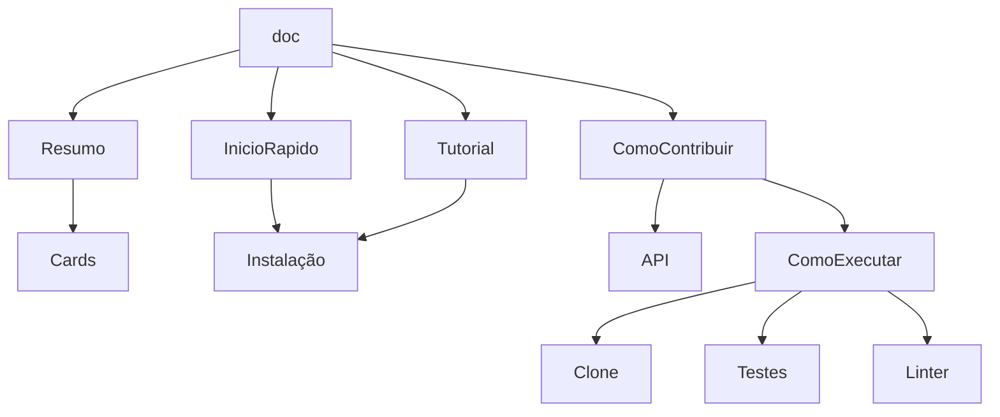

# Documentação

## Cards
Cards para levar para lugares específicos
*   Inicio rápido
* Tutorial
* Contribuição

## Inicio rápido
* Contexto sobre a aplicação 
    * Subcomandos do CLI
* Como instalar
    * pip install ...
* Como executar
    * Gancho com um contexto e uma explicação básica de cada comando
    * Help!

## Tutorial
*  Detalhar os objetivos
* Explicar cada subcomandos
    * Variações dos subcomandos

 ## Quero contribuir
 * Como executar o projeto
    * Como fazer os clones
    * Como rodar os teste
    * Como fazer os linters
    * Descrição dos módulos
        * Aponta para a documentação do API
* Dicas de contribuição com referências
    * Implementação das escalas
        * Wikipedia das escalas
    * Classes customizadas de Erros
        * NotaErro
    * Progressão harmônica
    * Implementação de acordes
    * Implementação de triades e tetrades
    * Funções harmônicas

## API
Explicar os módulos